# 🤖 AI Chat App

## 🚀 Live Demo

- **🌐 Frontend**: [ai-chat-livid-five.vercel.app](https://ai-chat-livid-five.vercel.app/)
- **⚡ Backend API**: [ai-chat-production-44df.up.railway.app](https://ai-chat-production-44df.up.railway.app/)

---

## 📖 Overview

AI Chat App revolutionizes how you interact with documents. Simply upload a PDF and engage in natural conversations about its content. AI assistant understands context, provides accurate answers, and cites relevant sources from your document.

### ✨ Key Features

- **Smart PDF Processing** - Upload and instantly chat with any PDF document
- **Secure & Private** - Your documents are processed securely with AWS infrastructure
- **Natural Conversations** - Ask questions in plain English, get contextual answers
- **Source Citations** - Every answer includes relevant excerpts from your document
- **Real-time Processing** - Fast document indexing with visual progress feedback
- **Beautiful UI** - Modern, responsive interface with smooth animations

---

## 🎯 User Journey

### Step 1: Authentication Simulation
- Enter your email address
- Session stored locally for seamless experience

### Step 2: Document Upload
- **Drag & drop** or **browse** to upload your PDF
- **Maximum file size**: 10MB
- **One document per user** - replace anytime by uploading a new file

### Step 3: AI Conversation
- Ask questions about your document content
- Receive intelligent, contextual responses
- View source citations for transparency
- Enjoy smooth, chat-like interactions

---

## 🛠️ Tech Stack

### Frontend Architecture
```
React 19 + TypeScript
├── Styling: TailwindCSS v4 + DaisyUI + Typography
├── State Management: TanStack React Query + Devtools
├── HTTP Client: Axios
├── Routing: React Router v7
├── Notifications: React Hot Toast
├── Markdown: React Markdown + Remark GFM
├── Icons: React Icons
└── Build Tool: Vite
```

### Backend Architecture
```
NestJS 11 + TypeScript
├── Database: MongoDB (Mongoose)
├── File Storage: AWS S3
├── Processing: AWS Step Functions + Lambda
├── Vector Search: Pinecone
├── AI: OpenAI GPT
├── PDF Parsing: pdf-parse
└── Configuration: dotenv
```

---

## 🏗️ System Architecture

### AWS Step Functions Workflow

```mermaid
graph TB
    A[📄 PDF Upload] --> B[📤 Store in S3]
    B --> C[🔍 Extract Text]
    C --> D[✂️ Chunk Text]
    D --> E[🧠 Generate Embeddings]
    E --> F[💾 Index in Pinecone]
    F --> G[✅ Update Status: Success]
    
    C --> H[❌ Error Handler]
    D --> H
    E --> H
    F --> H
    H --> I[📝 Update Status: Error]
```



### Step Functions Pipeline

1. **ExtractText** - Parse PDF content using `pdf-parse`
2. **ChunkText** - Intelligently split text for optimal search
3. **EmbedAndIndexChunks** - Generate embeddings and store in Pinecone
4. **UpdateStatusSuccess** - Mark document as ready for queries
5. **UpdateStatusError** - Handle and report processing failures

---

## ⚙️ Configuration

### Backend Environment Variables

```env
# AWS Configuration
AWS_REGION=us-east-1
AWS_S3_BUCKET_NAME=your-pdf-bucket
AWS_ACCESS_KEY_ID=your-access-key
AWS_SECRET_ACCESS_KEY=your-secret-key
STEP_FUNCTION_ARN=arn:aws:states:region:account:stateMachine:your-function

# Database
MONGO_URI=mongodb://localhost:27017/ai-chat

# AI Services
OPENAI_API_KEY=sk-your-openai-key
PINECONE_API_KEY=your-pinecone-key
PINECONE_ENVIRONMENT=your-environment
PINECONE_INDEX_NAME=your-index-name
```

### Frontend Environment Variables

```env
# API Configuration
VITE_API_BASE_URL=http://localhost:3000
```

---

## 🚀 Quick Start

### Prerequisites

- **Node.js** 18+ 
- **npm** or **yarn**
- **MongoDB** instance
- **AWS Account** with S3, Lambda, Step Functions
- **OpenAI API** key
- **Pinecone** account and index

### Installation

```bash
# 1. Clone the repository
git clone https://github.com/plinadev/ai-chat.git
cd ai-chat

# 2. Install frontend dependencies
cd frontend
npm install

# 3. Install backend dependencies
cd ../backend
npm install
```

### Development Setup

```bash
# 1. Configure environment variables (see Configuration section)

# 2. Start backend development server
cd backend
npm run start:dev

# 3. Start frontend development server (new terminal)
cd frontend
npm run dev
```

### 🏗️ AWS Infrastructure Setup

1. **Create S3 Bucket**
   - Enable CORS for file uploads
   - Configure appropriate bucket policies

2. **Set up Step Functions**
   - Create state machine with the processing workflow
   - Deploy Lambda functions for each step

3. **Configure Pinecone**
   - Create index with appropriate dimensions
   - Note your environment and index name

---

## 📱 Usage Guide

### 1. **Access the Application**
   Open [https://ai-chat-livid-five.vercel.app](https://ai-chat-livid-five.vercel.app)

### 2. **Sign In**
   - Enter your email address
   - Click "Continue" to proceed

### 3. **Upload Document**
   - Drag & drop your PDF or click to browse
   - Wait for processing completion (usually 10-30 seconds)

### 4. **Start Chatting**
   - Ask questions about your document
   - Examples:
     - *"What is this document about?"*
     - *"Summarize the key findings"*
     - *"What does it say about [specific topic]?"*

### 5. **Explore Features**
   - View source citations in AI responses
   - Upload a new document to replace the current one
   - Enjoy the smooth, responsive interface

---
